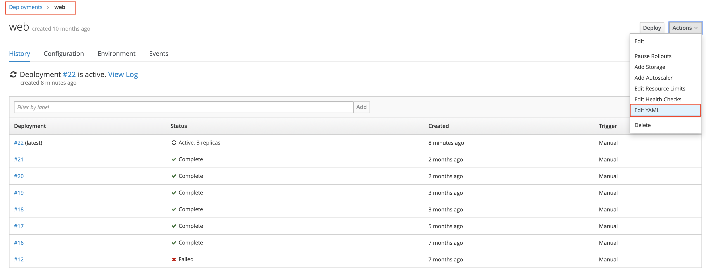

# InvenioRDM Demo site

The production demo site is accessible at [https://inveniordm.web.cern.ch](https://inveniordm.web.cern.ch).
The QA demo site is accessible at [https://inveniordm-qa.web.cern.ch](https://inveniordm-qa.web.cern.ch).

## Upgrade the instance

Both QA and production infrastructure project (OpenShift) are located at
[https://openshift.cern.ch](https://openshift.cern.ch):

* [inveniordm-qa](https://openshift.cern.ch/console/project/inveniordm-qa/)
* [inveniordm](https://openshift.cern.ch/console/project/inveniordm/)

The steps to upgrade any of the two instances to a newer version or release are the same.

**1. Upgrade code**

Code is on GitHub: [demo-inveniordm](https://github.com/inveniosoftware/demo-inveniordm).

!!! warning
    To lock the Pipenv file, in your machine **you need to have Python 3.7**. No other versions will work.
    This is because the base Docker image (at the moment of writing) is `centos8-python:3.7`.
    Other Python version might install some Python packages that are not compatible.

1. Create a PR with the needed changes. If you change `Pipenv` dependencies, make sure that you also add the
   new `Pipenv.lock` file. To do so, locally in your machine, delete the previous .lock file and run
   `pipenv lock`.
2. You can test such changes locally: the demo site is an InvenioRDM instance and thus can be used in your
   local machine with the usual *invenio-cli* commands.
3. Merge the PR: this will trigger a new Docker build (on GitHub actions) and push the new
   image to the GitHub Docker registry, tagged as `latest`. A notification will be sent to the **OpenShift QA** project
   which will trigger a new rolling deployment of the web and worker pods to deploy the new image. You can
   eventually deploy the new image by yourself by clicking on `Deploy` on OpenShift.


**2. Upgrade data**

!!! note
    This step is only needed if the data model changed, and therefore database and
    indexes need to be wiped out and re-populated.

You can perform the following steps by connecting to OpenShift on your terminal. However, you can do
the same steps with the `Terminal` provided in the OpenShift web UI.

- Login in OpenShift and select the project:
```console
oc login https://openshift.cern.ch
oc project inveniordm-qa
```
- Select one of the web pods to connect to, for example `web-18-wlbqs`:
```console
oc get pods
oc exec web-18-wlbqs /bin/bash -c
```
- Then you need to wipe and re-create the content. All the `invenio` commands needed
are available in the `wipe-recreate.sh` script. You just need to run it. In case you
need to cross-check anything (e.g. assets creation) the instance path is `/opt/invenio/var/instance/`.

**3. Upgrade the production site**

Once you are sure that the QA site is correctly upgraded and there are no errors,
you have to upgrade the production site. The first step is to create the docker image.

Create a new release commit and tag for the latest version in the
[repository](https://github.com/inveniosoftware/demo-inveniordm).

!!! note
    The tags naming convention follow the numeration of the `invenio-app-rdm` package. For example, if you
    deploying `invenio-app-rdm==0.25.9`, then the new release tag of the demo site will be `v0.25.9`.

```console
git commit --allow-empty -m "release: v0.25.9"
git tag v0.25.9
git push origin v0.25.9
```

This will trigger a new docker image build, that will be pushed to the GitHub Docker registry with tag `0.25.9`.

Once the GitHub action succeeds and the Docker image is ready to be deployed, you need to update
the references to the images' tags on the OpenShift project.
The easiest way to do it is manually on the web UI. For that go to the
[inveniordm](https://openshift.cern.ch/console/project/inveniordm/) project on OpenShift, then
*Applications -> Deployment -> Web -> Edit YAML*.




The image tag needs to be changed also for the `worker` pods.
*Applications -> Deployment -> Worker -> Edit YAML*.

Finally, repeat step 2 to re-create the data on the production site.
