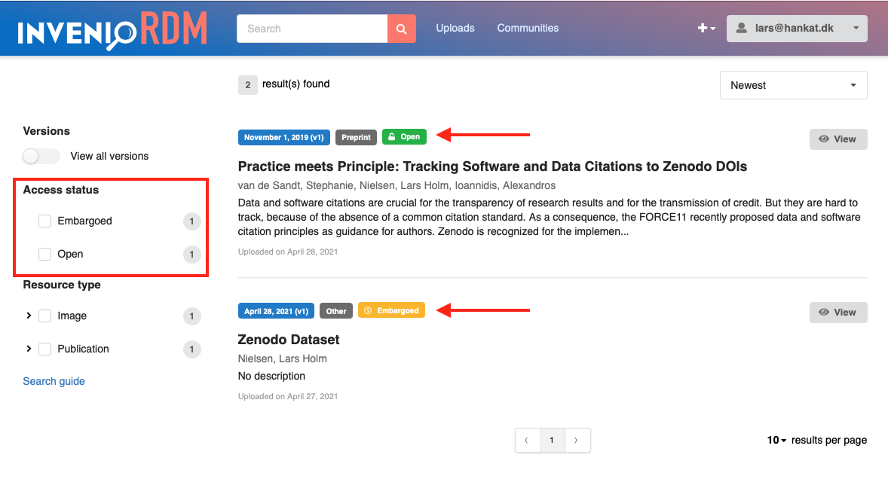
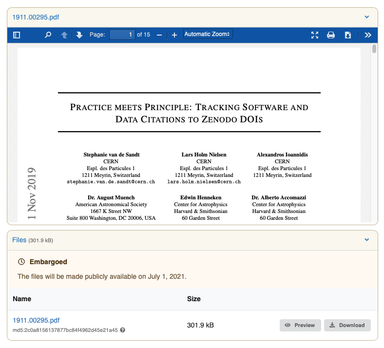
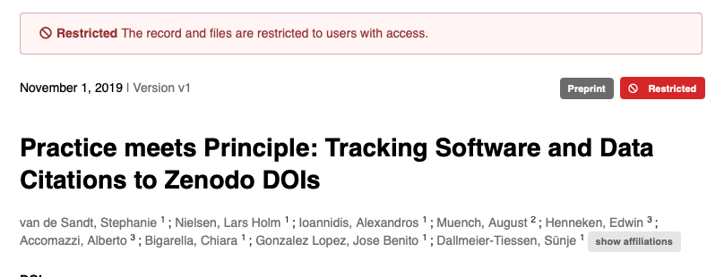
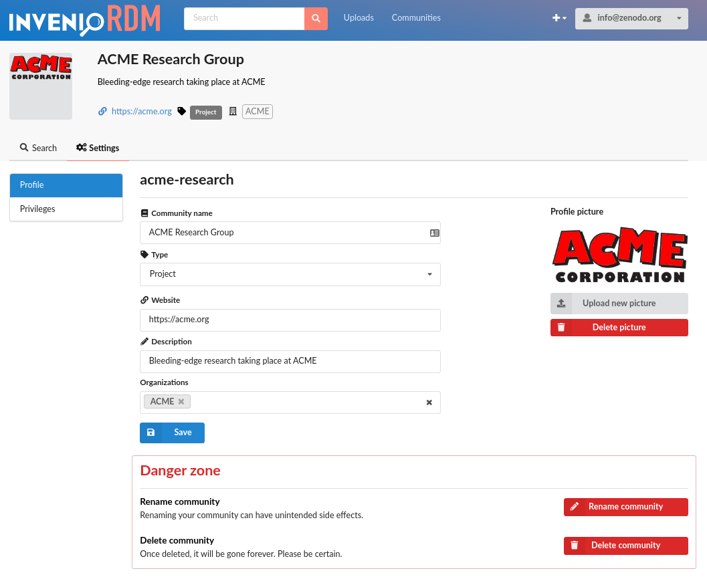
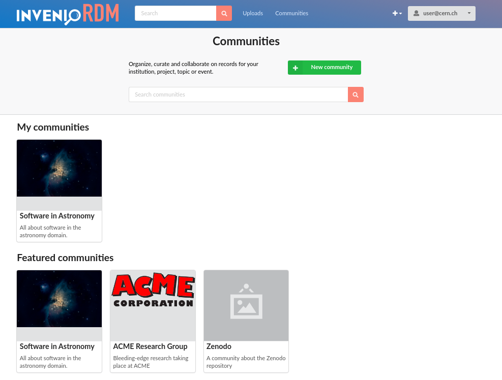

# InvenioRDM v3.0
We're happy to announce InvenioRDM v3.0!

!!! Warning

    InvenioRDM v3.0 is NOT yet suitable for production services.

## Try it

Want to try the new features in v3.0? Just head over to our demo site: [https://inveniordm.web.cern.ch](https://inveniordm.web.cern.ch)

If you want to install it, follow the installation instructions on [https://inveniordm.docs.cern.ch/install/](https://inveniordm.docs.cern.ch/install/)

## What's new?

InvenioRDM v3.0 is the most feature-packed release to date of InvenioRDM! Explore below to see what's been added this month.

### DOI registration

InvenioRDM can now register DataCite DOIs. This feature is an optional feature that you need to enable, as it requires having a DataCite contract and credentials to access their service.

If the feature is enabled, the deposit form will automatically ask the user if they already have a DOI for their upload.

If they don't, they have the option to reserve a DOI immediately, or simply leave the field empty and the DOI will be automatically registered.

**Landing page**

Once you publish the record, the DOI is automatically registered with DataCite and the landing page will show the DOI badge.

**Backend**

The DOI registration with DataCite is done using the new DataCite REST API together with the DataCite JSON format. The entire process happens transparently in a background job, and the DataCite metadata is updated every time a user publishes a change to a record.

The DOI is registered with a URL to the landing page where the DOI should resolve to. Instead of using the canonical URL (e.g. ``/records/12345-abcde``), we have a new endpoint that uses the DOI instead ``/doi/10.1234/foo.bar``. This allows us greater flexibility in the future to evolve the URL schemes, without having to go update DataCite with potentially millions of new URLs.

**Crossref DOIs, mEDRA DOIs, OP DOIs, DOE DOIs, Handles, EPICs, ARKs, OAI-PMH Identifiers, Report numbers, ...**

The backend works not only for DOIs but for any other external or internal persistent identifier you might have as long as a special PID provider plugin is written for your persistent identifier provider. This opens the possibility to support other DOI agencies than DataCite, support Handles, EPICs, ARKs, internal report numbers, etc. Right now, InvenioRDM is only shipped with a standard DataCite provider.

**Deduplication (TODO working or not?)**

The DOI minting feature serves another purpose as well: deduplication. InvenioRDM will not allow the same DOI to be deposited twice. This ensures that the same upload, with the same DOI, is not deposited multiple times inside the system.

**Using the new feature**

Check the [documentation TODO]() to see how to enable and configure the feature. Note that you'll need a testing account with DataCite to complete this. If you don't have that, you can check the demo site, where we have the DOI feature enabled.

**Known issues and future developments (TODO)**

- Restricted/embargoed records: DOIs are currently registered fro all records meaning if you create a DOI for a restricted record the metadata is sent to DataCite.
- DOI for the parent record
- Re-registering failed DOIs (e.g. due to remote REST API being down)
- Sign-posting; including the DOI in the landing page
- Upgrading JSON metadata format
- Dashboard for checking registration status
- DataCite XML serialization
- DataCite JSON export in the landing page
- Pressing the `GET DOI` button will reset the deposit form, loosing all non-already-saved content
- Sending an incorrect value for the DOI will not highlight the *Identifiers* field, but will not save the invalid value
- After sending and invalid DOI value, the form does not update the state. Thus to be able to save the draft again you need to reload the page or click the "GET DOI" button

### Alternate identifiers

In addition to being able to register DOIs, we can now also store information about other identifiers your upload may have. These identifiers are all considered to be metadata, and thus we do **not** use them operationally (e.g. to actively deduplicate content).

**Automatic scheme detection and normalization**

All identifiers are validated using the [IDUtils](https://idutils.readthedocs.io) library, and we store normalized values of all identifiers. For instance, a user may provide a DOI in several different forms:

- ``10.1234/foo.bar``
- ``doi:10.1234/foo.bar``
- ``http://dx.doi.org/10.1234/foo.bar``
- ``https://doi.org/10.1234/foo.bar``

However, the value we store internally in the system is the normalized value ``10.1234/foo.bar``. This is important for e.g. when you have to search for a specific identifier.

### Preview feature

We have now added the possibility to preview the landing page of a record prior to publishing a new record or changes to an existing record.

In the deposit form, you'll find the new button "Preview":

Clicking the preview button will take you to the landing page so you can see how your upload will look once published. The page has a header showing that it's a preview, and also certain parts of the landing page like the versions lists, will only show information from already published versions.

**Reviewing prior to publication**

The preview feature is not only useful for the uploader to  visually see the landing page. In combination with the "Get a link" feature, it can be used to share a preview of a dataset with colleagues or peer reviewers prior to the publication.

### Get a link

InvenioRDM v2.0 shipped with REST API support for creating secret links that could be used to share restricted records/files. InvenioRDM v3.0 now adds preliminary support in the UI to allow users to get a link to share a restricted record's files.

The feature is accessed via the new Share-button on the landing page:

The user will be presented with a dialog where they can choose between different permission-levels for the link. Currently two are supported: "can view" and "can edit". We plan to add also a "can preview", to support single-blind peer-reviews for example.

**Future directions**

We plan on heavily expanding the share button to support sharing with specific users and groups of users as well as managing multiple secret links and their expiry date.

**Known issues**

- Only a single link can be managed

### Access status indicators

The access status indicators which was removed in the InvenioRDM v1.0 release is now back again as promised.

**Badges and facets**

All records now display an access status badge that can be one of either (according to the [COAR Access Rights Vocabulary](http://vocabularies.coar-repositories.org/documentation/access_rights/)):

- Open
- Embargoed
- Restricted
- Metadata-only

You are also able to filter records according to these values using the search facets.

The values are computed based on the visibility settings, embargo, and whether the record has files or not.

**File listing/preview**

In addition to having the access badge indicators, we now also have clear color coding on the file listing and previews to aid users in understanding if they are viewing restricted files. Below is an example of a record with restricted files as seen by the owner and seen by an anonymous visitor:

**Restricted landing pages**

In cases where the full record is either embargoed or restricted, we also display a top-level banner on the record to distinguish it from the case where only the files are restricted:

### Communities (feature preview)

InvenioRDM v3.0 also ships with a feature preview of the new Communities. The feature is hidden by default from the UI, and must be enabled to view it.

The basics include:

- Creating, updating, renaming and deleting a community
- A communities search and settings page

**Creating a community**

We've tried to simplify the community setup as much as possible, by only requiring very minimal information in the setup form (name, identifier and visibility).

Afterwards, users are taken directly to the profile page, where further changes can be made and logos uploaded.

**Browsing communities**

You can search and browse communities from the top community headline. By default, we display first any communities that you're a member of (right now that equals all communities that you own), and we display featured communities (right now this is just the top-5 newest communities).

### Files from previous version

It is now possible to import files from the previous version when you create a new version of a record. When you create a new version, you're presented with a button to import files.

Using a button allows us to improve the user experience for two different use cases:

1. A user that has a single new file (e.g. a new version of a presentation).
2. A user that has a large dataset in the form of numerous files that wants to add a new data file.

Based on experiences from Zenodo, we've seen there's a signifcant number of users who don't naturally notice files if they were automatically imported from the previous version (use case 1). Often, these users miss the fact that a file was already there, which later results in a support request to remove it.

Having the import button ensures that users who have potentially very large datasets don't have to reupload potentially 100s of GBs of data, and it also allows us to efficiently store only the extra additional data that was actually changed (e.g. if you change/add only a 10KB file in new version of a 100GB dataset we only store the extra new 10KB).

### Internals: Auto-completion/Search-as-you-type

We've fixed the issue with the language field in the deposit form providing bad auto-completion suggestions. For instance, it was previously hard or even impossible to select English!

The fix has resulted in a new feature in the REST API: auto-completion support via a new query parameter ``?suggest=``.

Overall, we have two different search scenarios:

- Search
- Auto-completion

The main difference between the two is what the user provides as input: full or partial terms.

**Search**

In the search scenario, a user provides a full term or phrase (e.g. ``molecules``). The search engine analyses and normalises the term (singular/plural etc), and looks for documents that include the term.

**Auto-completion/Search-as-you-type**

In the auto-completion scenario a user provides a partial term or phrase (e.g. ``mol``) and the job of the search engine is to find potential full terms (e.g. ``molecule``).

**Implementation**

Technically, the auto-completion scenario which we added in this release is implemented via using something called edge n-gram indexing. Simplified, this means that when we index a term ``molecule``, we automatically also index additional terms ``m``, ``mo``, ``mol``, ``mole``, ... so that we can efficiently query the terms. Most of this magic is done by Elasticsearch.

### Internals: JSONSchema resolution and registry

Internally, InvenioRDM stores records as JSON documents, and we validate the structure of those documents with JSONSchemas. Until this month, it was not easy to reuse parts of one JSONSchema in another schema. This eventually led to a lot of duplication, which we have now fixed. This change was an important change going forward, as we need to regularly evolve the internal data model.

For those technically interested, the changes and reasoning behind this is documented in [this RFC](https://github.com/inveniosoftware/rfcs/blob/master/rfcs/framework-0042-jsonschema-validation.md).

### Internals: Source code cleanup

We have done a larger cleanup of the codebase in preparation for getting a much larger team onboard with InvenioRDM. Some of these changes for instance mean that it will be easier to allow running InvenioRDM on a subpath in a domain instead of on the root path of a domain.

## Minor features and bug fixes

**Deposit**

- Fixed a validation issue that allowed unknown fields in the metadata key to slip through the service level validation, but caused a 500 error on the JSONSchema validation.
- Fixed issue that allowed record with files to be published without having files via the REST API.
- Fixed issues that allowed the owner of a record to modify files on a record after publishing the record.
- Fixed issue that returned a 500 error instead of a 400 error when invalid JSON was submitted to the REST API.
- Fixed interaction issue that allowed accidental creation of two drafts by fast double clicking on certain buttons in the UI.
- List of creators/contributors now display the creators' roles and ORCIDs.
- Fixed an issue where no validation error was displayed to users if files were missing from the deposit form.
- Fixed an issue where the files protection options were not displayed until the first file was uploaded.
- Fixed the display of validation error messages, to show human readable labels for all errors.
- Fixed an issue where no validation message was shown when file limits were exceed.
- Fixed large file upload - now files up to 50GB can be uploaded.

**Search**

- Fixed an issue with the sort options showing "Best match" instead of "Newest" when searching with an empty query.
- Fixed a styling issue on the search results page related to a record title covering a button.
- Fixed a styling issue for long text in the facets.
- Fixed an issue with nested facets not being taken into account correctly.

**Landing page**

- Fixed an issue with previewable files with uppercase extensions (e.g.``.JPG``) not being previewable.
- Fixed an issue with the preview box not showing the correct filename being previewed.

**Invenio-CLI**

- Improved the detection of Python versions v3.8 and v3.9.
- Fixed an issue with first time development installation of React modules using ``invenio-cli assets install/watch-module``.
- Removed the option to use SQLite as the backend database.
- RabbitMQ docker image updated to v3.8.
- Fixed an issue with `invenio-cli services setup --force` not always forcefully setting up services.
- Improved the speed of fixture loading by offloading the actual loading to background jobs. This means that fixtures are now loaded the first time you run ``invenio-cli run``.

## Backward incompatible changes

- Removed the ``PUT /api/records/:id/draft/files`` endpoint to enable/disable files and  select default file preview/order. Instead, it's now part of the ``PUT /api/records/:id/draft`` endpoint.

- We are deprecating the usage of ``SITE_HOSTNAME`` in favour of ``SITE_API_URL`` and ``SITE_UI_URL``.

## Credits

The development work in this release was done by:

- CERN (Alex, Antonio, Audirus, Diego, Ezgi, George, Ines, Javier, Lars, Marco, Nico, Pablo, Pablo, Parth, Rodrigo, Zach)
- Northwestern University (Guillaume)
- Caltech (Tom Morrell)
