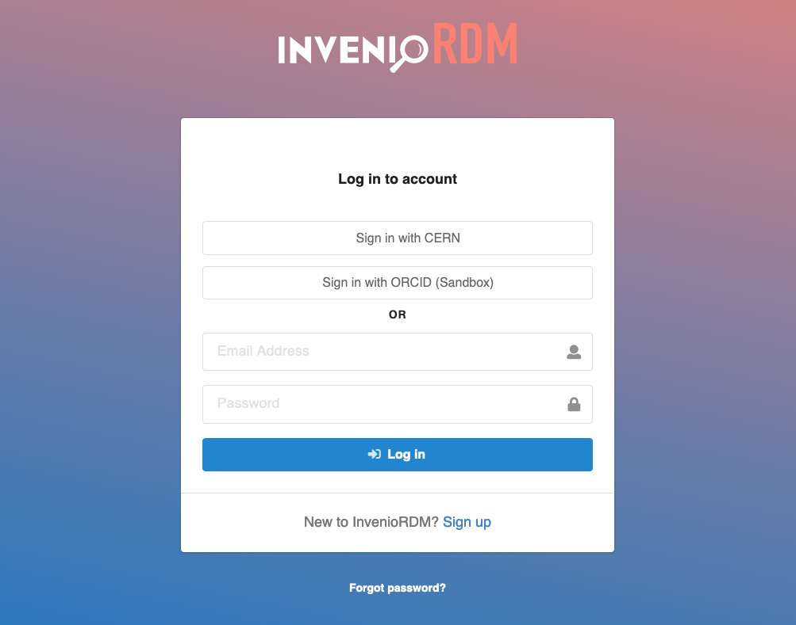
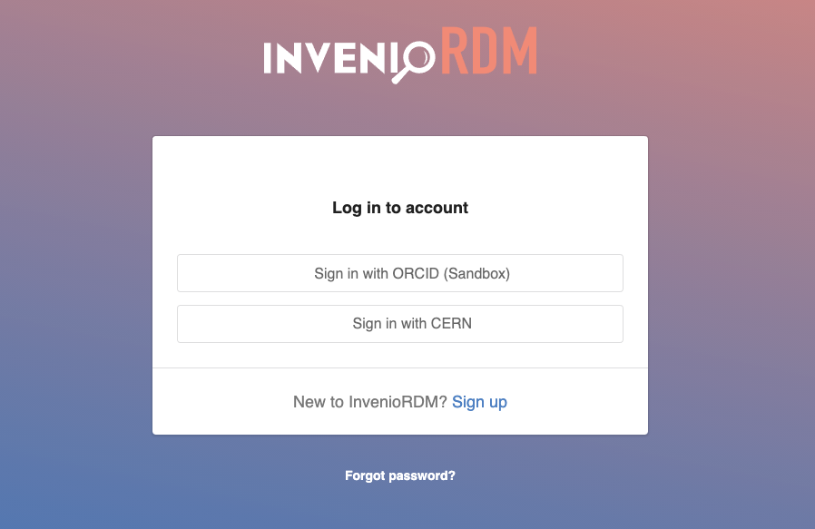
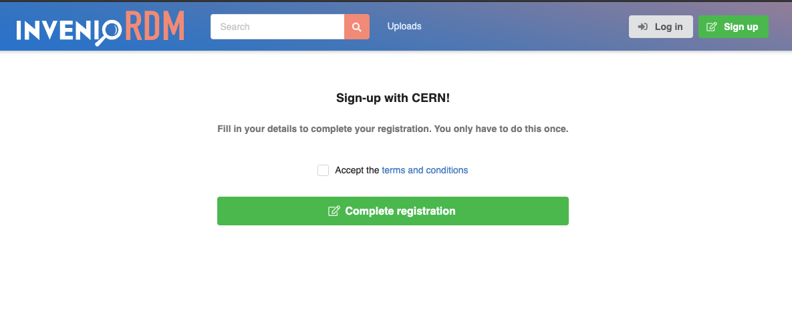

# InvenioRDM v4.0

We're happy to announce InvenioRDM v4.0!

!!! Warning

    InvenioRDM v4.0 is **NOT** yet suitable for production services.

## Try it

Want to try the new features in v4.0? Just head over to our demo site: [https://inveniordm.web.cern.ch](https://inveniordm.web.cern.ch)

If you want to install it, follow the installation instructions on [https://inveniordm.docs.cern.ch/install/](https://inveniordm.docs.cern.ch/install/)

## What's new?

### Single sign-on (SSO)

InvenioRDM can now easily integrate with external authentication providers. You can enable ORCID integration and OpenID Connect/OAuth with Keycloak servers.

Read the [Authentication](/customize/authentication/) documentation section to get to know how to set it up.

SAML integration is also supported but it requires a more advanced setup.

InvenioRDM v4.0 comes with various new features around authentication.

#### Disable local login

You can now e.g. disable local authentication (login and registration) via a configuration variable.

Changes to the user profile (change full name or e-mail address) can be blocked, which is particularly useful when using only external authentication in your setup.

#### Terms & conditions

After the first login with an external authentication provider, InvenioRDM can now prompt a custom account registration form to require input of extra information. For example, the user can be asked to accept the website's terms and conditions.

When only one external authentication provided is configured, InvenioRDM can be configured to skip the login page and automatically redirect to the external login page.

More detailed documentation describes how a new OAuth plugin integration can be implemented.

### Vocabularies

This month we continued work on vocabularies. Most notably we migrated the resource types from the old to the new vocabulary and made them easily customizable.

Read more about this [here](/customize/application_data/).

#### Facets labelling

We've made it a lot easier to define new facets as well as provide human-readable labels for them. End-users won't notice any changes this month, but the update was important for the coming vocabularies we have to migrate.

#### Performance improvements

As part of a overall review of the vocabularies integration, we've made several performance optimizations to ensure that searching and landing page rendering is as fast as possible.

### IIIF and file processing

During this month, we've done initial work in integrating the Mirardor v3 IIIF image preview (Google Maps style viewing of large images). Most of the changes will only be visible in the coming v5.0 release. However, backend users will now see that for images (JPEG, PNG and TIFF) we are automatically extracting the width and height of the image in an async process.

### Minor features

- Landing page: We now also show the DataCite JSON serialization as export option.
- Landing page: Minor styling fixes in the deposit form and landing page.
- Docs: Add documentation on how to install DejaVu font for rendering DOI badges.
- Deposit form: The given name is no longer required.
- Internals: Refactored the record service into smaller sub-services.
- Search page: Added a German translation of the page.

### Backward incompatible changes

- Resource types - the metadata when creating a record has now changed from having two keys ``{"type": ..., "subtype": ...}`` to having a single key ``{"id": ... }``.

- Image width/height extraction requires having `ImageMagick` installed (the Docker images have been updated to support this).

- REMINDER: We are deprecating the usage of ``SITE_HOSTNAME`` in favour of ``SITE_API_URL`` and ``SITE_UI_URL``.

## Credits

The development work in this release was done by:

- Brookhaven National Laboratory (Carlos)
- CERN (Alex, Ezgi, George, Ines, Javier, Lars, Nico, Pablo, Pablo, Zach)
- Data Futures (Dan Granville)
- Northwestern University (Guillaume)
- TU Wien (Max)
- TU Graz (Mojib)
