# InvenioRDM v9.0

*2022-05-24*

*Long-term support (LTS) release*

We're happy to announce the release of InvenioRDM v9.0. The release is a long-term support release which is maintained until the next LTS release + 6 months (and minimum for 1 year).

## Try it

- [Demo site](https://inveniordm.web.cern.ch)

- [Installation instructions](https://inveniordm.docs.cern.ch/install/)

## What's new?

InvenioRDM v9.0 ships with the much anticipated communities feature! 🎉

### Communities

Communities is a new core feature of InvenioRDM that empower users to
self-organise and manage content in InvenioRDM. The feature launching
has focused on two main use cases:

- Submit a record for review in a community
- Manage members of a community

This is only the beginning of the community feature and we're expecting to
heavily expand the feature in the future.

#### Visibility: Public or restricted

Communities visibility can be set to either:

- *public* - any user can see the community
- *restricted* - only community members can see the community

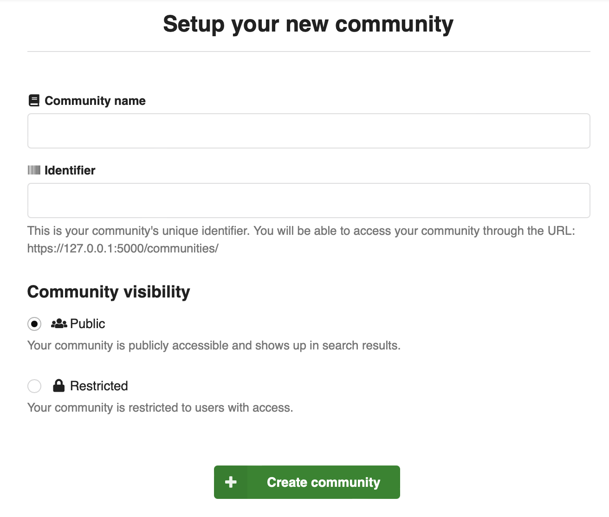

Both public and restricted communities can contain restricted records, and thus
not all records in a public community may be visible to everyone. A restricted
community on the other hand may only contain restricted records.

#### Records and branding

A community may co-own any number of records, and users can search through
the records of the community:


Records that are owned by a community are, by default, branded with the community
as well:

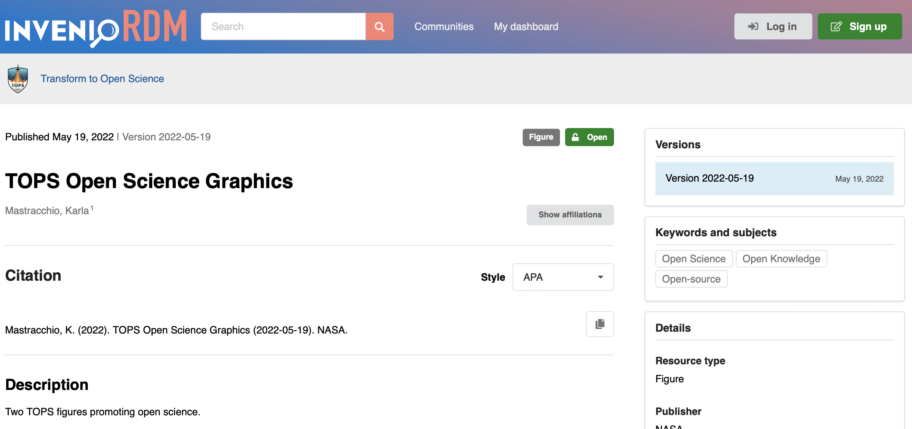

#### Members

A community by default always has one or more owners, but you can invite
multiple members to a community. Members can be either people or groups:

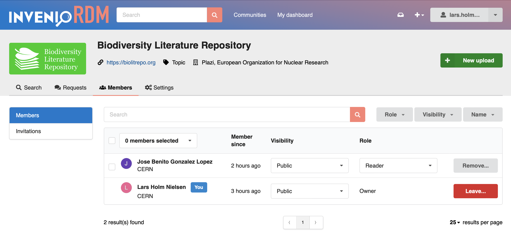

It's possible to disable support for group members via the ``COMMUNITIES_GROUPS_ENABLED``
feature flag. See the [groups](https://inveniordm.docs.cern.ch/customize/authentication/#groups)
section to know how to integrate groups in your instance.

#### Roles

All community members have a role that determine what they are able to do within
a community. By default InvenioRDM comes with the following roles:

- **Reader**: A reader is a member of the community and can view restricted
  records owned by the community.
- **Curator**: A curator can in addition to a reader also edit/accept/decline
  records in a community.
- **Manager**: A manager can in addition to curators also manage
  members of a community.
- **Owner**: An owner has full administrative access to a community, and can
  change all settings as well as delete the community.

The role definitions are configurable via the ``COMMUNITIES_ROLES`` configuration
variable. Thus, both titles and capabilities of the roles can be modified.

#### Member invitations

Owners and managers can invite other users to join the community. Groups can be
added directly as a member of the community:

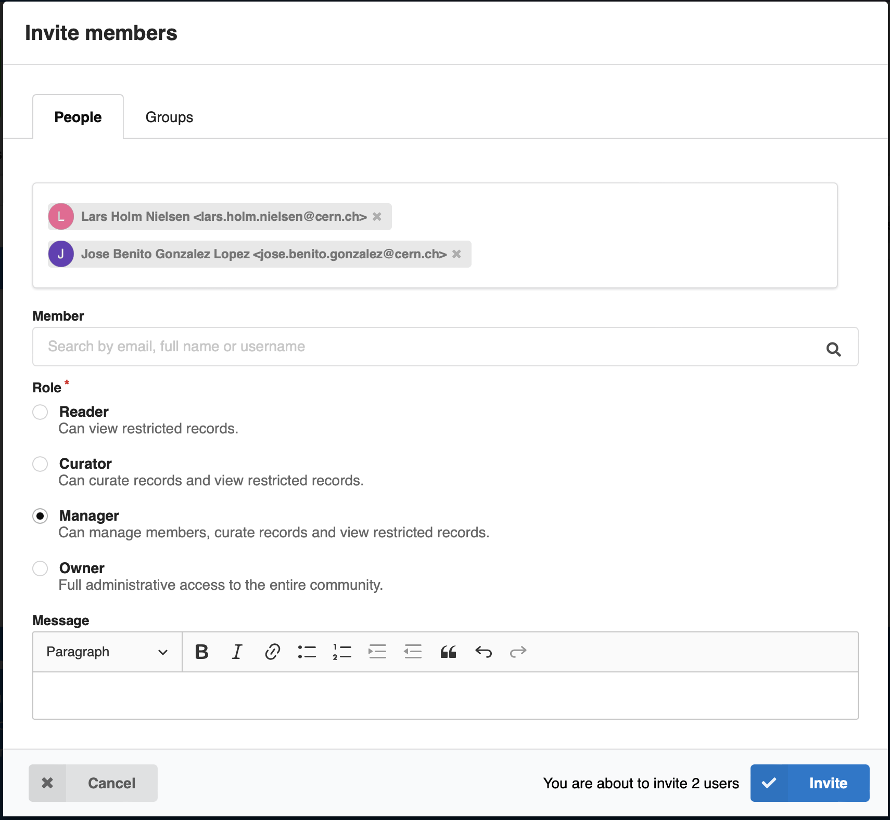

The invited user can accept/decline the invitation and in addition have a
conversation with the sender of the invitation:

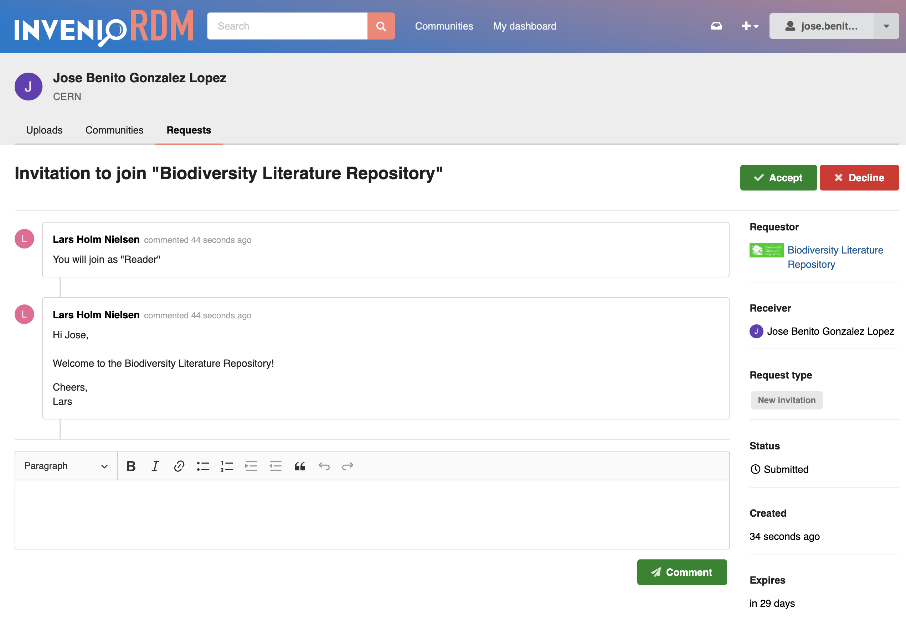

By default invitations automatically expire after 30 days and become invalid.

#### Reviews

Any user can submit records to public communities for review:


At submission time, a message can also be provided to the community curators:

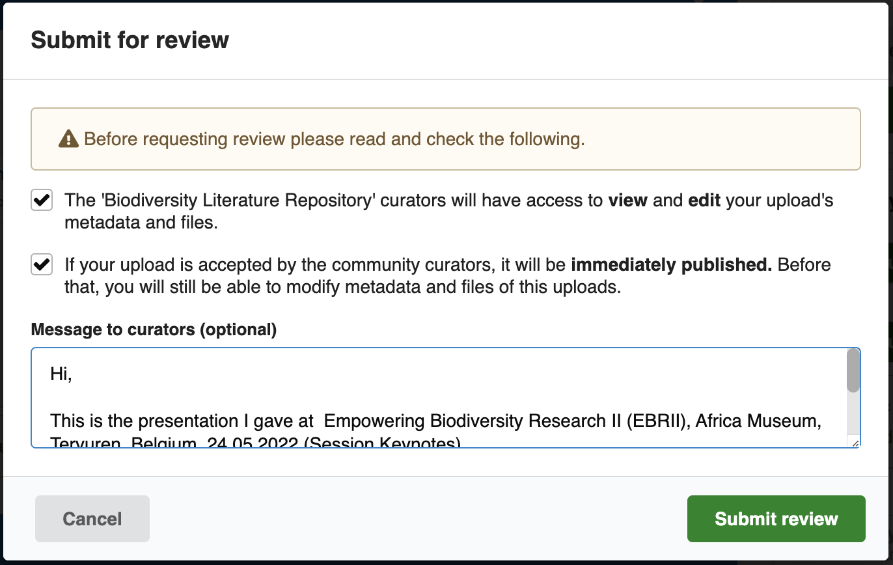

**Curation**

Curators of the community will receive the review request under the new
"Requests" tab, and can have a conversation with the submitter, as well as
preview the submitted record. Both the submitter and curator can edit and update
the record under review until it's published. Once published the record is
owned by both the submitter and the community:


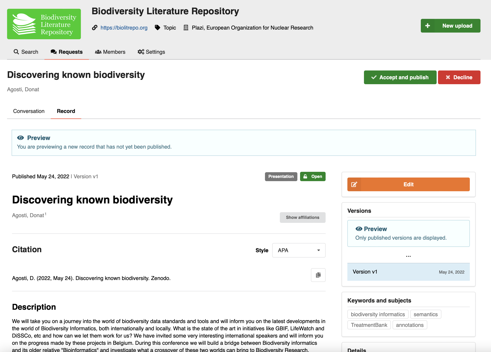

See also the [Reviews REST API documentation](../../reference/rest_api_reviews.md).

#### Backend

You may have noticed that both invitations and reviews look similar and enable
a conversation between a submitter and receiver of the request as well as
allowing them to perform certain actions like accept/decline/cancel/expire.

The backend of this new feature is our new powerful requests module. The module
enables us to more easily build new automated workflows in the future. Some of
the new request types we're expecting to see in the future includes:

- File replacement
- Record removal
- Ownership transfers
- Quota increases
- Access requests
- Record claiming

Overall, the new backend is a key enabler for automating as much as possible
standard requests that requires some sort of human approval. We are also looking
forward to expand the requests module with assignees and status checks that could
be updated from externally running workflows.

See documentation on the [requests architecture](../../develop/architecture/requests.md).

#### Limitations

This is the very first release of the communities module, and thus also the
current implementation have some key limitations that we're working to address
as fast as possible. We've listed below the most important limitations:

- **Email notifications**: There is no notification mechanism, and thus no
  emails or similar are sent for new requests. Users must go to
  their dashboard, or community requests, to see if there's any new requests or
  new messages.

- **Add to community after publish**: If you publish directly, and later want
  to add a record to a community there's currently no way for the submitter or
  community curators to submit or claim records.

- **Removal from community**: Once a record is accepted into a community, there
  is no user interface for removing the record from the community again. It's
  possible to programmatically remove records from a community.

- **Featured communities**: A REST API exists for managing featured communities
  however there is no user interface on top of it yet.

- **Community logos and avatars**: The current implementation of community logos
  requires extra work and design in order to better present a community.

- **Community search vs global search**: Currently we have two search fields,
  one in the header to search all records, and one separate on the community
  search for records in the community. We want to integrate both of them into
  a single search field in the header.

### Users, groups and profiles

In v9 we have also revamp the user registration and user profiles support.
InvenioRDM now has basic support for customizable user profiles and
preferences. In addition we have expanded the default user profile to include
an affiliations field as well. You'll notice the new profile and preferences
field in multiple ways.

First, the user registration form now shows more fields in addition
to email and password, namely:

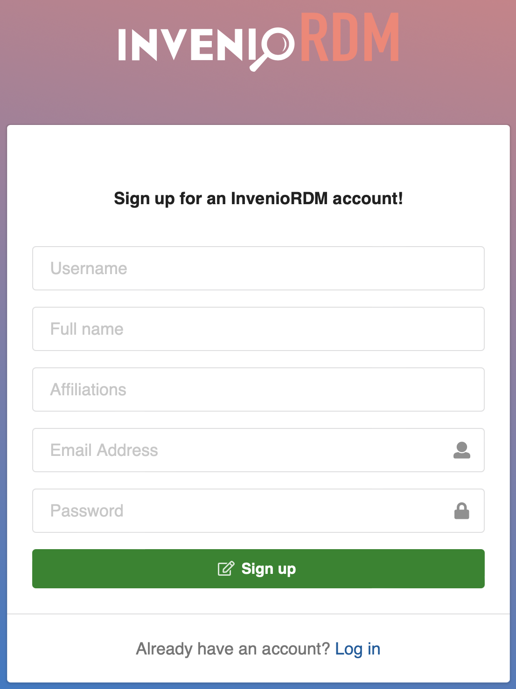

On the user's account settings page the new fields as well as the user
preferences field will be displayed:

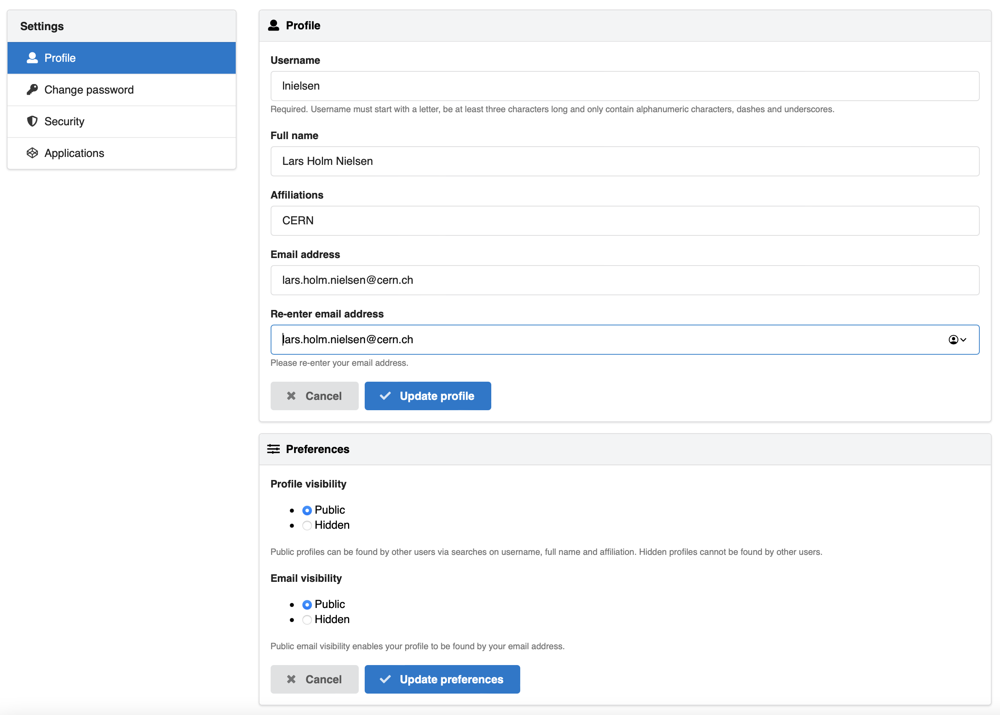

**User preferences**

The user preferences has currently two options:

- Profile visibility
- Email visibility

The options allow a user to control if they can be found by other users of the
system by their profile information. By default, a user must explicitly enable
the profile/email visibility in order to be found. If users are automatically
created (e.g. from an institutional identity management solution), the system
can automatically set these preferences for the user on creation.

**Avatars**

Users and groups now also have basic avatars. The avatars are created by taking
a letter from the full name, username or email and compute a color for the
user:


In the future, the idea is to support user uploaded avatars, identicons and
online avatar services.

**Verified email required for login**

A user is now required to confirm their email address via a link
sent to their email address in order to be able to login. The previous
behavior of v8.0 and earlier can be reenabled by setting the following
configuration variable:

```
SECURITY_LOGIN_WITHOUT_CONFIRMATION = True
```

Note, that for a user to be findable by other users, they must have verified
their email address and set their profile visibility to public.

**Users and groups REST API**

InvenioRDM comes with a complete new REST APIs for users and groups search.
The REST API powers for instance the member search when inviting new members
to a community:


The REST API is currently limited to search, but will be extended in the future
to also support creation and management of users and groups.

See [REST API documentation](../../reference/rest_api_users.md).

**Backend changes**

A significant fraction of the new features outlined above is enabled by some
larger changes to the backend. User and groups are now indexed in the search
cluster and thus we have separate profile information from e.g. login
information and added features for tracking changes to users.

Also, we've moved a database table from Invenio-OAuthclient tracking external
user identities to Invenio-Accounts. All of these changes are handled
automatically by the upgrade procedures.

### Funders and awards

We have added support for adding funding information to both records
and communities:


You can either search the funders/awards database for an existing award or
add a custom award:

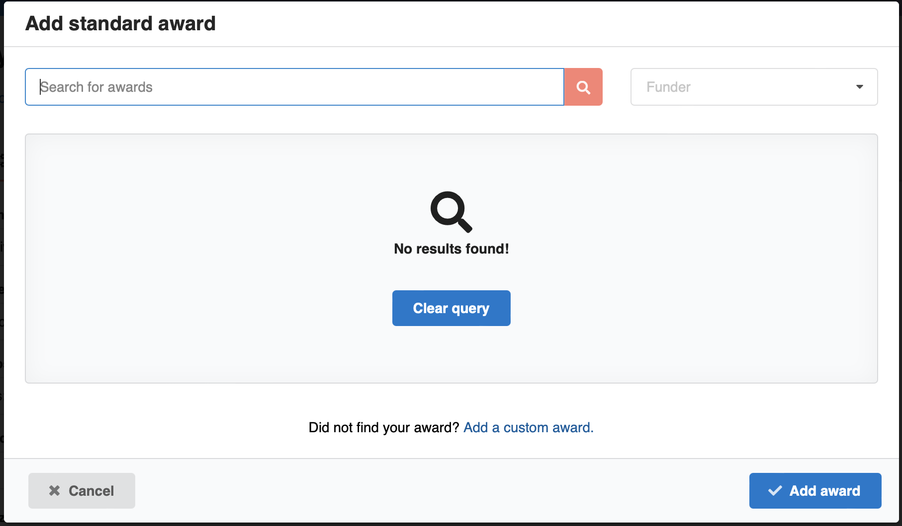

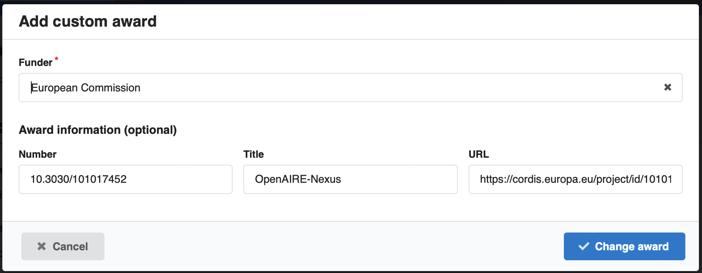

The features is driven by the underlying funder and award vocabulary. Both
vocabularies can be loaded with data according to your organisational needs.
You could for instance decide to load CrossRef Funder Registry or ROR into the
funder vocabulary, and the awards vocabulary could be loaded from the OpenAIRE
grants database.

### User Experience (UX) improvements

We have made a number of smaller UX improvements.

**Light background on array fields**

Array fields in the deposit form (e.g. dates, related identifiers) now have a light
grey background around the group of fields for a single entry. This makes it
easier to see which fields belongs together (especially in mobile/tablet views):


**Responsive design and screen real estate**

We've now managed to fix responsive design issues on most pages in InvenioRDM
and thus pages work in both desktop, tablet and mobile browsers. This has also
meant that e.g. the deposit form and record landing pages have more screen real
estate to display their information on.

**Backend: Theme polishing**

The InvenioRDM theme was refactored and cleaned up, providing better
overridability for subthemes and instances. See [documentation](../../customize/styling.md) for further
details.

### OAI-PMH sets support

The OAI-PMH server in InvenioRDM has now been extended with sets support
that was missing in earlier implementations.

You can see an example of the set [here](https://inveniordm.web.cern.ch/oai2d?verb=ListSets).

**Sets for communities**

An OAI-PMH set is automatically created for each *public* community. This
allows any public community to be harvested.

**Custom sets**

In addition to the sets created for communities, it's also possible for an
administrator to create custom sets. A custom set is simply defined by a
search query.

**Management REST API**

The custom OAI-PMH sets can currently be managed via the REST API. A future
version will add a user interface to allow an administrator to manage the
sets.

See [OAI-PMH REST API documentation](../../reference/rest_api_oaipmh_sets.md).

### Backend: Flask-Security to Flask-Security-Invenio

Invenio Framework has for a long time relied on the Flask-Security module for
providing the core authentication and authorization features. Unfortunately,
the module has not been maintained for quite some time, and thus we have
decided to maintain a private fork named Flask-Security-Invenio of the module
ourselves.

We have released Flask-Security-Invenio v3.1.x based on Flask-Security 3.0
as a stripped down version where we have removed features that were not used
by Invenio such as e.g. token and basic authentication methods. We decided
not to migrate to the community fork named Flask-Security-Too due to a
significantly feature scope such as two-factor authentication.

We highly recommend that you use a proper identity and access management
solution together with InvenioRDM such as e.g. Keycloak or e.g. ORCID. These
systems are specifically focused on providing secure authentication and support
the lastest methods such as two-factor authentication.

### Backend: Bulk indexing and automatic propagation of updates

InvenioRDM now ships with support for bulk indexing (i.e. indexing multiple records in a single indexing request to a search cluster). Bulk indexing is needed for performance reasons when we have to index many records at once. This happens for instance if we update a vocabulary record (e.g. resource type, affiliation, etc.), and as a result have to propagate the changes to related records.

Bulk indexing works by having the application queue a request to index one or more records. A background worker then checks every 10 seconds (via the ``invenio_records_resources.tasks.manage_indexer_queues`` task) to see if there are any queued indexing requests, and if so, will kick-off the bulk indexing. The bulk indexing will index up to 500 records at a time.

### Backend: Search field transformer

We have added basic backend support for parsing and transforming search
queries. This allows us in the future to improve the fields that users can use
in search queries. For instance today, a user will have to write
``metadata.title:...`` to search specifically on the title field. In the future,
using the search field transformer, we're now able to parse the query from the
user and automatically modify and transform the query, so a user can search
on e.g. ``title:...`` instead.

The new search field transformer is currently used in the new users/groups
REST API so you can search on fields like ``name``, ``email``,
``username`` and ``affiliation`` when looking for users to invite to a
community.

Below is an example on how the search field transformer is used:

```python
from invenio_records_resources.services.records.queryparser import (
    QueryParser,
    SearchFieldTransformer,
)

class UserSearchOptions(SearchOptions):
    # ...

    query_parser_cls = QueryParser.factory(
        fields=["username^2", "email^2", "profile.full_name^3", "profile.affiliations"],
        tree_transformer_factory=SearchFieldTransformer.factory(
            mapping={
                "affiliation": "profile.affiliations",
                "affiliations": "profile.affiliations",
                "email": "email",
                "full_name": "profile.full_name",
                "fullname": "profile.full_name",
                "name": "profile.full_name",
                "username": "username",
            }
        ),
    )
```

## Upgrading to v9.0

!!! warning "Upgrade not yet supported"

  We have unfortunately not managed to finalise the upgrade recipes to v9.0
  at the time of the release. The release team is working hard to release the
  upgrade instructions as fast as possible, and we expect to have finalised
  the upgrade recipe latest by June 1st 2022.

Please see the [upgrade notice](../upgrading/upgrade-v9.0.md).

## Maintenance policy

InvenioRDM v9.0 is a **long-term support** (LTS) release which is supported until the next LTS release + 6 months and for minimum 1 year. See our [Maintenance Policy](../maintenance-policy.md).

## Requirements

InvenioRDM v9.0 supports:

- Python 3.7, 3.8 and 3.9
- PostgreSQL 10+
- Elasticsearch 7

Note that Python 3.6, Elasticsearch 6 and PostgreSQL 9 have all reached end of life and are no longer supported by their respective organisations.
